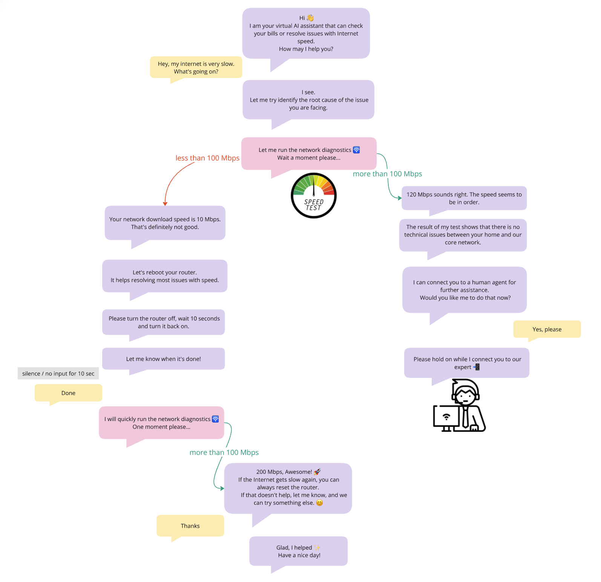

# starterpack-telco-en

## Rasa Starter Pack: Telecom in English
<p align="center">
  
</p>

Rasa has created a new starter pack for building AI assistants in Telecom with the Rasa CALM framework.
This repository contains a Rasa chatbot designed to assist customers with common internet service issues. The chatbot currently supports two primary flows:

- Troubleshooting Slow Internet
  - In this flow we help the user solve the issue what the chatbot can do for the user
    - run diagnostics : to make sure the speed test is in order
    - reset the router for the user if restarting the router doesn't help. resetting router is an action that the bot will perform, restarting the bot is ans action that we ask the user to do.
- Checking and Managing Bills
  - run custom actions the check our DataBase(in our case our CSV)
  - give a recap on the expensed the user is having
  - connect them to a human agent if needed and make sure they always have a way to get their answer.

You can use this demo assistant as a starting point for your own Telecom Intelligent Assistant, or get ideas for features you might want to implement. It's free for you to copy and use locally with the Rasa Pro Developer Edition.

# Project Structure

Here's a brief description of the directories and files in the project root:
  - **README.md**: The file you're currently reading!
  - **actions:** Contains Python scripts defining custom actions for the Rasa assistant.
  - **csvs:** Contains csv file that are used to mimic the behavior of connecting to a database to get customer information.
  - **data:** Contains flow definitions for the assistant and NLY folder. if needed to have flows to be triggered by some intents add the nlu file with examples for intents.
  - **docs:** Contains sample documents for Enterprise Search.
  - **domain:** Contains domain files for the assistant.
  - **prompts**: Contains Jinja2 template files for generating prompts.
  - **tests:** Contains end-to-end test scenarios for the assistant where each subdirectory reflects a suite of tests (i.e. happy path).
  - **Config:** Contains multiple configuration components for the assistant (i.e. different language models and settings). if Intents are needed then we need the NLU pipeline for it(tokennizer, featurizer, intent classifier ..) and **NLUCommandAdaptor** will be the component that will start a flow based on the intent prediction.
  - **Credentials**: Contains credentials for various services used by the Rasa assistant (i.e. Chat Widget)
  - **Endpoints**: Contains endpoint configurations for the Rasa assistant. 
    - How to run the action server is added
    - How to call NLG server
    - How to define the model group

# Conversation design
 
# Conversation example
##  **First example**: happy path with solving "internet slow" issue

  - **Bot**: Hey Serena 👋
        I am your virtual AI assistant that can check your bills or resolve issues with Internet speed.
        How may I help you?
  - **User**: My internet is slow
  - **Bot**: <BR>
            I see. <BR>
            Let me try identify the root cause of the issue you are facing.<BR>
            I will run a network diagnostics for you 🛜 <BR>
            Wait a moment please... <BR>
            Thank you for waiting... ✅ <BR>
            Your network download speed is 53 Mbps. <BR>
            That's definitely not good. <BR>
            Let's reboot your router.
            It helps resolving most issues with speed.
            Please turn the router off, wait 10 seconds and turn it back on.
            Let me know when you are done!
  - **User**: Done
  - **Bot**: <BR>
            I will run a network diagnostics for you 🛜 <BR>
            Wait a moment please... <BR>
            Thank you for waiting... ✅ <BR>
            111 Mbps, Awesome! 🚀 <BR>
            If the Internet gets slow again, you can always reset the router. <BR>
            If that doesn't help, let me know, and we can try something else. 😊 <BR>

##  **Second example**: Providing human agent help when needed in the "billing" use case
  - **User**: can you tell me my expenses? <BR>
  - **Bot**: <BR> 
            Alright. Could you please specify the month? 📅
  - **User**: Feb
  - **Bot**: <BR>
            Your bill for February 2025 is $55.00.<BR>
            The average of your past bills is $88.50.<BR>
            This bill is lower than your average by $33.50.<BR>
            Would you like to see the breakdown of the costs?
  - **User**: Nope
  - **Bot**: Did I manage to provide all the information you need?
  - **User**: No
  - **Bot**: <BR>
            Let me connect you to our human support managers. They will help you further! <BR>
          Please hold on while I connect you to our expert 📲 <BR>

##  **Third example**: Intervening and asking a knowledge questions base during a conversation
  - **User**:  my internet is so slow lately
  - **Bot**: <BR>
          I see.
          Let me try identify the root cause of the issue you are facing.<BR>
          I will run a network diagnostics for you 🛜<BR>
          Wait a moment please... <BR>
          .. 10 second pass ..  <BR>
          Thank you for waiting... ✅   <BR>
          102 Mbps sounds right. The speed seems to be in order.<BR>
          The result of my test shows that there is no technical issues between your home and our core network.<BR>
          However, if you're still experiencing slow browsing or buffering,it could be due to network congestion, too many connected devices, or Wi-Fi interference.<BR>
          Try moving closer to your router or disconnecting unused devices.<BR>
          I can connect you to a human agent for further assistance. <BR>
          Would you like me to do that now?<BR>
  - **User**: "what is a speed test"
  - **Bot**: <BR>
          A speed test is a process run by specific software to measure the performance of your internet connection. <BR>
          It evaluates your download and upload speeds, latency, and jitter to determine how fast data is sent and received. This can impact activities like streaming, gaming, and video calls.<BR>
  - **Bot**: <BR>
          I can connect you to a human agent for further assistance. <BR>
          Would you like me to do that now?<BR>
  - **User**: "Yes, please"
  - **Bot**: <BR>
          Please hold on while I connect you to our expert 📲<BR>
##  **Fourth example**: digression and updating an information during the conversation

  - **User**: I would like to verify my expenses for January's bill
  - **Bot**: <BR> 
           Your bill for January 2025 is $150.50. <BR>
           The average of your past bills is $88.50. <BR>
           This bill is higher than your average by $62.00.<BR>
  - **Bot**: <BR> 
          Would you like to see the breakdown of the costs?
  - **User**: oh no I meant February
  - **Bot**: <BR> 
          Alright, I'm changing the bill month to February for you.
          Your bill for February 2025 is $55.00.<BR>
          The average of your past bills is $88.50.<BR>
          This bill is lower than your average by $33.50. <BR>
  - **Bot**: <BR>
          Would you like to see the breakdown of the costs?
  - **User**: No, that's fine
  - **Bot**: <BR> 
          Did I manage to provide all the information you need?<BR> 
  - **User**: Yup
  - **Bot**: <BR>
          Glad, I helped ✨ <BR>
          Have a nice day! <BR>

# Features and bot content explanation.
 You can find in this bot
 - **Actions** : custom actions, mimic getting information from a DB, either adding it to the session start or afterwards in the conversation. I mimic this behavior by getting information about customers from two CSVs.
 - **RAG** : enterprise search if the ask knowledge base questions
 - **Data**
    - **Flows** : are build to handle user questions about "internet is slow" or "check their bill". Different features are used : calling or linking a flow, branching on a slot value.
    - **Patterns** : Over-ride some patterns, to change the behavior. make sure to add the same patterns name as the originals.
 - **Documents** : have general information on what is a router how to start it ... this can be triggered at any point of the conversation and then the assistant will go back to finish the flow
 - **Domain** : contains all bot answeres, details/definition about all slots and mention the custom actions
  - **Responses** : I added simple once, one with buttons and others with images
  - **Slots** : different slot type and mapping
    - **type** : Float, text, bool and categorical
    - **mappings** : from_llm, and custom
 - **Images** : These images are used in the README
 - **Prompts** : This prompt looks like the original, I just remove the **CHITCHAT** command and added details for the `SearchAndReply()`. in the config you can see that I pointed to use this prompt.
 - **Tests** : this is a good way to test the bot's capabilities and ensure the same behavior when doing changes and updates. With Assertions we can track commands and when slots are set. The folder contains 7 test cases, this can help you better understand how the bot function. Results of the current tests are available in the tests folder to illustrate how e2e test works, however you can obtain the same result by running the command `rasa test e2e tests/e2e_test_cases -o` 
 - **Config**: We have two sections, the pipeline and the policies
     - the pipeline we have `SingleStepLLMCommandGenerator` that will convert user messages into commands, we add the LLM we want to use here
     - the policies: two policies are used in this assistant the `FlowPolicy` and the `EnterpriseSearchPolicy`


# Installation
You can find [here](https://learning.rasa.com/pre-requisites/pre-requisites/) our Rasa enabelment and step by step guide on how to install Rasa. <BR>
And you can find [here](https://rasa.com/docs/pro/installation/overview/) in our docs an installation Overview.
## Prerequisites
- Rasa licence for 3.11 +
- Python 3.10 +
- Point to the LLM provider in the endpoint.yml and config.yml 
  it can be open AI, finetuned model or any other LLM provider see [here](https://rasa.com/docs/rasa-pro/concepts/components/llm-configuration-from-3-11)

## Set up 

- Clone the repository:

  ```shell
  git clone <rasa-customers/starterpack-telco-en.git>
  cd <rasa-customers/starterpack-telco-en>
  ```

- Create and activate a virtual environment, you can use `venv` (built-in Python virtual environment) or any other virtual environment manager.

```shell
  python -m venv venv
  source venv/bin/activate  # On Windows: venv\Scripts\activate
```
  Make sure this environment is always active when you are testing or building the assistant.

- Train the Rasa model: `rasa train`


# Running the Bot
- To run the bot you can use `rasa inspect --debug`
- After any changes made to your data, domain folder or config file you need to retrain the bot running `rasa train` and if changes are made in the custom actions just re-run `rasa inspect --debug`
- after adding changes, make sure to add `e2e test cases`, to do so
  - set `RASA_PRO_BETA_E2E_ASSERTIONS=true` environment variable before
running the command.
  - install `pip install mlflow` when you use an LLM to generate the answer, when usung enterprise search.
  - run `rasa test e2e <add path to the test folder> -o` to see how the bot is performing, `-o` to get the results
    For this project it will be `rasa test e2e tests/e2e_test_cases -o` in the tests folder you will then have two files
      - `e2e_results_failed.yml` and `e2e_results_passed.yml`


# Tips
- Check our [docs](https://rasa.com/docs/reference/primitives/) to understand all Rasa primitives:
  - Get familiar with all flow properties, patterns, responses
- Start writting e2e test cases right when you start writting your flows, you can start by copying what we have in **inspector view** in the **End-2end test** section.
- when you are trying to debug look for these sections in your logs
  - always review the prompt in the logs to make sure the right flows and slots are available and check the conversation history to better understand the bot's behavior
  - search for `action_list` to see the command that was predicted by CALM, this will help you debug
    For instance, it can be `action_list=StartFlow(understand_bill)` or `action_list=SetSlot(bill_month, 2025-01-01)`
  - search for `commands=` 
    For instance `commands=[StartFlowCommand(flow='bot_challenge')]`
  - check the **tracker state** in the **inspector view**
  - add `logging.info` to you custom actions to get more visibility.


# Next Steps
- Identify the use cases, you would like to add to this assistant.
  - it can be improving the existing two or add new ones
    Examples:
    - Create and track support tickets for unresolved issues.
    - Notify users about due dates and payment confirmations.
    - Detect suspicious account activity and alert customers.
- Create diagrams that illustartes the conversation flow, A conversation designer will be a perfect expert to rely on to accoumplish this step.
- Start building the flows and adding e2e test cases
- Share the first versions with your colleague to test and provide feedback.
- Improve, test, re share 🔁

# Contributing
Feel free to fork this repo and submit pull requests. Suggestions and improvements are always welcome!

# License
- This project is licensed under the Apache 2.0 License, allowing modification, distribution, and usage with proper attribution.
